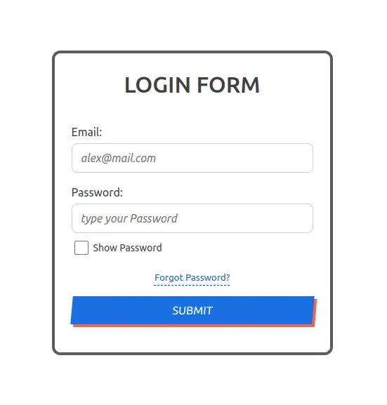

# test-auth-form

> тестовое/учебное задание

Auth Form на чистом JS

- Умею в React, но решил сделать на чистом JS
- Посчитал излишним тащить React для одной формы
- Также было интересно реализовать всё на чистом JS и с нативной валидацией
- Заодно познакомился с Parcel и подружил его с Jest 😄
- В конце понял, что нативная валидация не всесильна и она требует донастройки
- Также не совсем удобно писать тесты на чистую верстку, тут есть варианты - или придется дублировать компоненты, или делать их на чистом JS, ну тогда мы изобретем свой React 😄

## Features

- Валидация полей email и password
- Симуляция отправки формы на сервер через отложенный Promise
- Обработка успешного и неуспешного ответа, статуса ожидания с блокировкой формы
- Тесты Jest & Testing-library на валидацию и отправку формы
- Зелёный Lighthouse 👍

## Setup

```sh
npm ci
npm start
```

## Preview


